# Simple RayTracer in C++

The aim is to build from scratch a CPU ray tracer (sphere tracing) for implicit surfaces (Signed Distance Functions).

I'm taking inspiration from:

  * *Ray Tracing from the Ground Up* by Kevin Suffern
  * *Ray Tracing in One Weekend* by Peter Shirley
  * [scratchpixel](https://www.scratchapixel.com/lessons/advanced-rendering/rendering-distance-fields) tutorials

## Dependencies
* GLFW and OpenGL for window

## Project Structure

### Directories

    .
    ├── imgs                  # Output images
    ├── include               # Headers files
    │   ├── Camera.h          # Represents a perspective camera
    │   ├── Color.h           # Representation of RGB color
    │   ├── geometry.h        # Contains geometry utilities i.e. Point3, Vec3, Mat4x4, ...
    │   ├── Image.h           # Grid of RBG pixels, can be written in PPM format
    │   ├── ImplicitShape.h   # SDF representations i.e. Sphere, Torus, Cube, ...
    │   ├── Light.h           # Abstraction for all lights i.e. PointLight and AmbientLight
    │   ├── Octree.h          # Sparse Voxel Octree
    │   ├── Ray.h             # Abstraction for camera rays
    │   ├── Renderer.h        # Given a Scene uses a Camera and a Tracer to create an Image
    │   ├── Scene.h           # Collection of SceneObjects i.e. shapes and lights
    │   ├── SceneObject.h     # Abstraction for a general 3D object
    │   ├── scenes.h          # Callable pre-made scenes
    │   ├── Tracer.h          # Given a ray, it analyzes its life
    │   ├── utilities.h       # Miscellaneous functions
    │   └── Window.h          # Abstraction for a window, it can be use to show an Image
    ├── src                   # CPP files
    │   ├── main.cpp          # Execution starting point
    │   └── ...
    ├── CMakeLists.txt
    ├── README.md
    ├── SVO_Munini.pdf        # Presentation slides
    ├── compile.sh            # Use CMake to do a clean build of the project
    └── run.sh                # Build the project if necessary and then run it

### Execution
The code can be executed with `./run.sh` or with `./main` after a successful compilation via `./compile.sh`.

In `main.cpp` a scene is generated through a call to a `scenes.h` function e.g. `make_Scene_Octree_2()`, then the scene is given to both a default renderer, which does not use the Octree representation, and a renderer with the SVO enabled calling the `useOctree()` method.

Both the renderers can output the result into a window or into a PPM file.
Calling `disableWindow()` force the renderer to create an image in the `wip_imgs/` directory.

Trough `main.cpp` is also possible to change the output image size.

The renderer if needed initializes an SVO of the scene and then uses an adequate tracer to generate the image.
The code provides two tracers: the first is a sphere tracer and it uses directly the SDF representations of scene objects; the second takes advantage of the SVO and only inside a non-empty leaf voxel it uses a sphere trace approach.

## DONE

* Constructive Solid Geometry (CSG)
  * [here](https://www.iquilezles.org/www/articles/smin/smin.htm)
    and [here](https://www.scratchapixel.com/lessons/advanced-rendering/rendering-distance-fields/constructive-solid-geometry-blends-deformers)
    for theory

* obj transformations

## TODO

* blending and anti-aliasing
  * AA with cone-tracing
  * [here for theory](https://www.scratchapixel.com/lessons/advanced-rendering/rendering-distance-fields/basic-sphere-tracer)

## Examples

## Debugging "fun"
### how it should be...
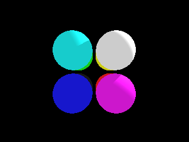
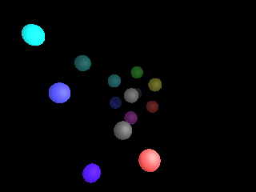
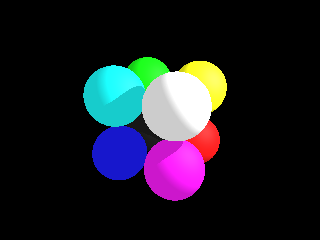
### showing svo root's children
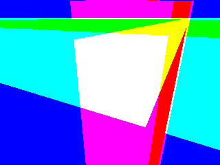
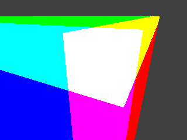
### showing children of the 7-th root's children
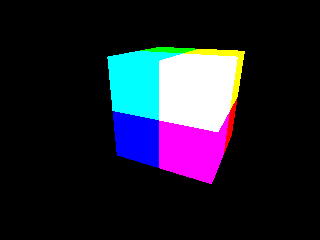
### debug images
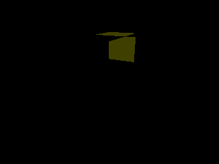
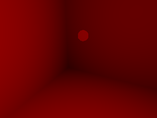
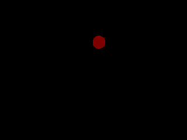
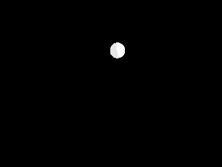

## Example with SVO enabled
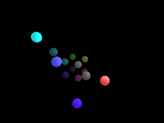
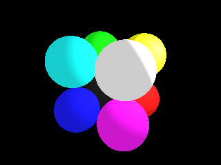
### shadows can be enabled but their computation doesn't take advantage of the SVO at the moment
