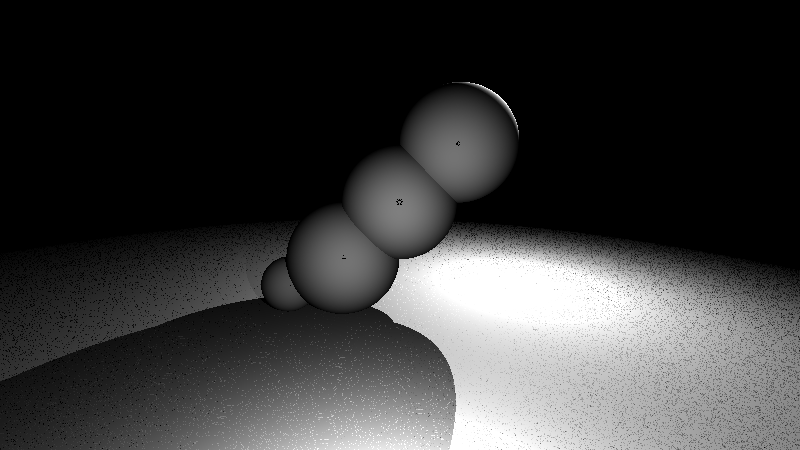
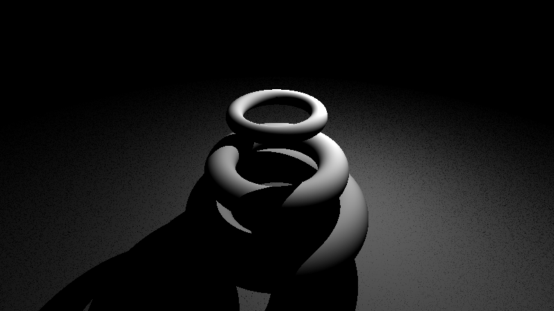
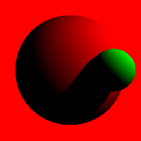
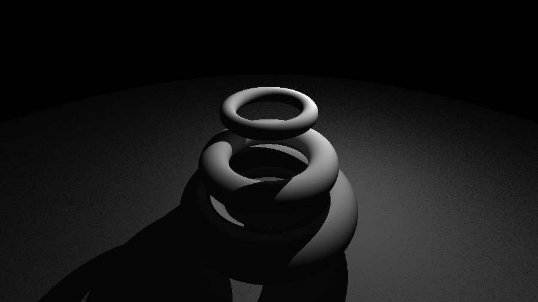

# Simple RayTracer in C++

The aim is to build from scratch a CPU ray tracer (sphere tracing) for implicit surfaces (Signed Distance Functions).

I'm taking inspiration from:

  * *Ray Tracing from the Ground Up* by Kevin Suffern
  * *Ray Tracing in One Weekend* by Peter Shirley
  * [scratchpixel](https://www.scratchapixel.com/lessons/advanced-rendering/rendering-distance-fields) tutorials

## Dependencies
* SDL2
* GLM (removable)

## DONE

* Constructive Solid Geometry (CSG)
  * [here](https://www.iquilezles.org/www/articles/smin/smin.htm)
    and [here](https://www.scratchapixel.com/lessons/advanced-rendering/rendering-distance-fields/constructive-solid-geometry-blends-deformers)
    for theory

## TODO

* obj transformations

* blending and anti-aliasing
  * AA with cone-tracing
  * [here for theory](https://www.scratchapixel.com/lessons/advanced-rendering/rendering-distance-fields/basic-sphere-tracer)

## Examples

### Without Blending and Anti-Aliasing

Simple CSG

CSG Shadow Debug Process

### New Images

